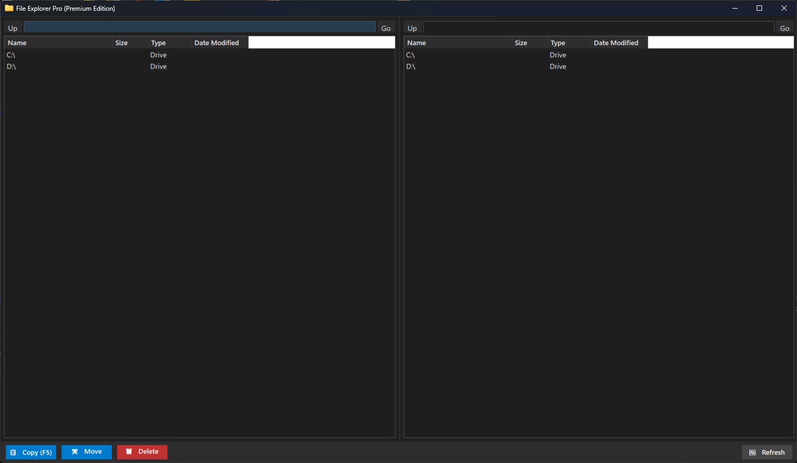

# File Explorer Pro (Premium Edition)

A high-performance, dual-pane portable file manager written in C# and .NET WinForms. Built specifically for IT Administration to bypass the friction of managing files across multiple drives under different user contexts.



## Features
- **True Portable Executable**: Compiles down to a single `.exe` file. No installer required.
- **Dual-Pane Interface**: WinSCP/Total Commander style layout for lightning-fast file transfers between local and USB drives.
- **Premium Dark Mode**: Modern, flat UI with custom-drawn headers and native Windows dark scrollbars.
- **Keyboard Driven**: Use `F5` to Copy, `F6` to Move, and `Delete`/`F8` to Delete.

## Build Instructions
To build the standalone executable, ensure you have the .NET SDK installed, then run:
```bash
dotnet publish -c Release -r win-x64 --self-contained true -p:PublishSingleFile=true
```

## Usage
Simply right click the compiled executable and select **Run as Administrator** to manage restricted environments seamlessly!
